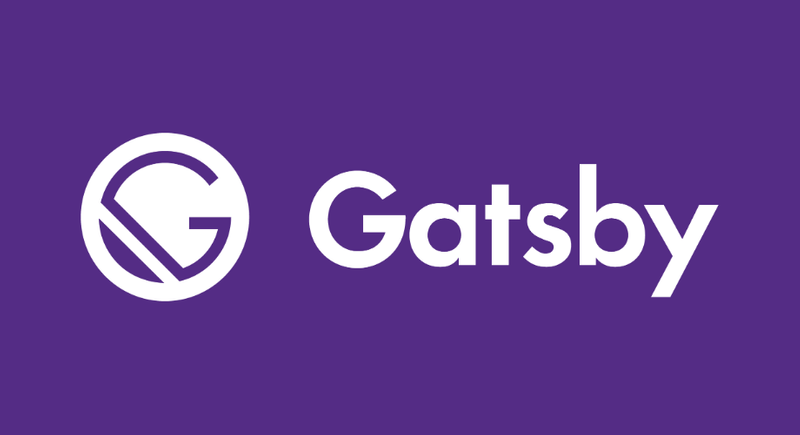

Vou deixar aqui o [link](https://github.com/AMarcosCastelo/my-portfolio) do GitHub com o repositório do projeto para vocês darem uma olhada e como o código é aberto, até podem contribuir caso queiram.

## Tecnologias utilizadas

* [Gatsby](https://www.gatsbyjs.org/) - Framework open source para gerar todo o estático.
* [GraphQL](https://graphql.org/) - Linguagem para a consulta de dados em tempo de execução.
* [SVG](https://pt.wikipedia.org/wiki/SVG) - Para os ícones e para as animações.
* [GreenSock](https://greensock.com/) - Biblioteca para as animações.
* [Styled Components](https://styled-components.com/) - Para trabalhar com CSS dentro do JavaScript.
* [Styled Icons](https://styled-icons.js.org/) - Para importação dos ícones em SVG.
* [Algolia](https://www.algolia.com/) - Para a criação do sistema de busca.
* [Netlify CMS ](https://www.netlifycms.org/)- Gerenciador de conteúdo, open source, de fácil implementação com o Gatsby
* [Netlify](https://www.netlify.com/) - *Static hosting* para a publicação do blog direto do GitHub.


## Gatsby



[Gatsby](https://www.gatsbyjs.org/) é um SSG (Static Site Generator), com o plus de ser totalmente baseado em React, gratuito, open source e utiliza o GraphQL para consumir todo o conteúdo e os assets.

O Gatsby contém algumas ferramentas excelentes que o diferencia de outros SSG. Primeiro, ele é baseado em React em tempo de desenvolvimento, o que é uma ótima escolha pra quem ama trabalhar com React igual a mim. Segundo, ele possuí milhares de plugins que fornecem soluções do dia-a-dia, assim o dev perde menos tempo com tarefas chatas e sobra mais tempo pra focar no essencial da aplicação. Terceiro, por gerar arquivos estáticos e ter sistemas de cache, a performance é perfeita.

Mas como sempre, não existe bala de prata no mundo Web, para projetos com um volume grande de conteúdo dinâmico ele não é uma boa escolha.

## GraphQL


O [GraphQL](https://graphql.org/) foi criado pelo Facebook e é uma das mais modernas maneiras de construir e consultar APIs. Ele é uma sintaxe que descreve como solicitar dados e geralmente é usado para carregar dados de um servidor para um client.

GraphQL possui algumas características principais:

* Permite que o client especifique exatamente quais dados precisa. Isso torna mais fácil agregar dados de várias fontes;
* Usa um sistema de tipos para descrever os dados.

Uma consulta GraphQL é uma string que é enviada para o servidor para ser interpretada e assim preenchida, retornando o JSON de volta ao client:

```javascript
export const query = graphql`
  query MyPost {
    markdownRemark {
      fields {
        slug
      }
      frontmatter {
        title
        description
      }
    }
  }`;
```

E devolve os dados:

```json

  "data": {
    "markdownRemark": {
      "fields": {
        "slug": "/hello-world/"
      },
      "frontmatter": {
        "title": "Hello World",
        "description": "Um pouco sobre minha trajetória até a criação desse portfólio/blog. "
      }
    }
  }
}
```

## SVG

SVG (Scalable Vector Graphics) é uma linguagem XML para descrever de forma vetorial desenhos bidimensionais, sejam estáticos, dinâmicos ou animados.

No Portfólio/Blog todos os ícones e animações são feitos com SVG em conjunto com o [GreenSock](https://greensock.com/) para animações, que falarei mais adiante neste post.

Mas porque usar SVG e não outros formatos?

Uma das principais vantagens do SVG é o tamanho do arquivo. O peso do arquivo costuma ser bem pequeno e isso pode melhorar usando alguma ferramenta de compactação.

O SVG é responsivo e não perde resolução em diferentes tamanhos de telas, ou seja, mantém a qualidade seja em uma tela de celular ou de uma televisão.

Ele é interativo e estilizável via CSS, além de ser adaptativo, você pode modificar o SVG de varias maneiras via CSS.

## GreenSock

O [GreenSock](https://greensock.com/) é uma biblioteca para animação que interage com qualquer coisa que o JavaScript pode manipular (propriedades CSS, SVG, canvas, o que for), além de resolver inúmeras inconsistências do navegador.

Por que usar o GreenSock?

* É super performático;
* Compatível com todos os browsers (até o IE8, bixo!);
* Pode animar qualquer coisa (CSS, SVG, Canvas, HTML, etc);
* Total controle das animações (pause, avance, reverta, aumente/diminua a velocidade);
* Api intuitiva e fácil de aprender.


## Styled Components

Um dos maiores problemas no CSS é a especificidade, colisão de classes pode literalmente atrapalhar um projeto e tira o dev do sério.

Surgiram várias tentativas de resolver esse problema, como o OOCSS, BEM, SMACSS, etc... Infelizmente essas metodologias não são escaláveis por depender da ação humana para funcionar.

O Styled Components permite a gravação de CSS no JavaScript (CSS-in-JS) usando Template Strings com tags. Podemos considerar que ele é um sucessor do CSS Modules, uma maneira de escrever CSS com escopo para um único componente e não vazar para nenhum outro elemento da página.

Um exemplo básico:

```javascript
import styled from "styled-components";
import media from 'styled-media-query';

export const AboutHeader = styled.header`
  color: #fff;
  margin: auto;
  padding: 2rem 5rem;
`;
```

Código gerado automáticamente:

```css
.styled__AboutHeader-kiNEpj {
    color: #fff;
    margin: auto;
    padding: 2rem 5rem;
}
```